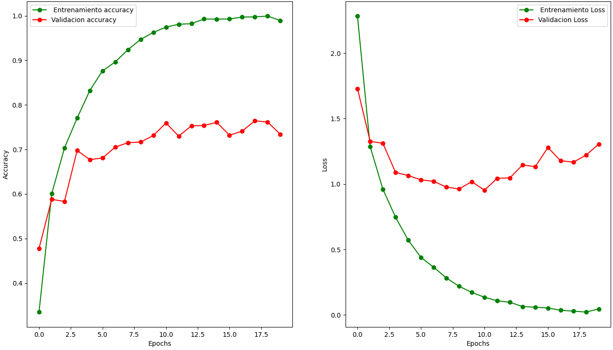
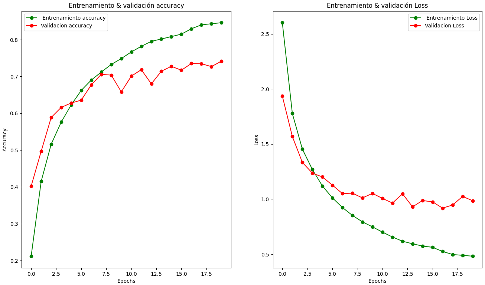
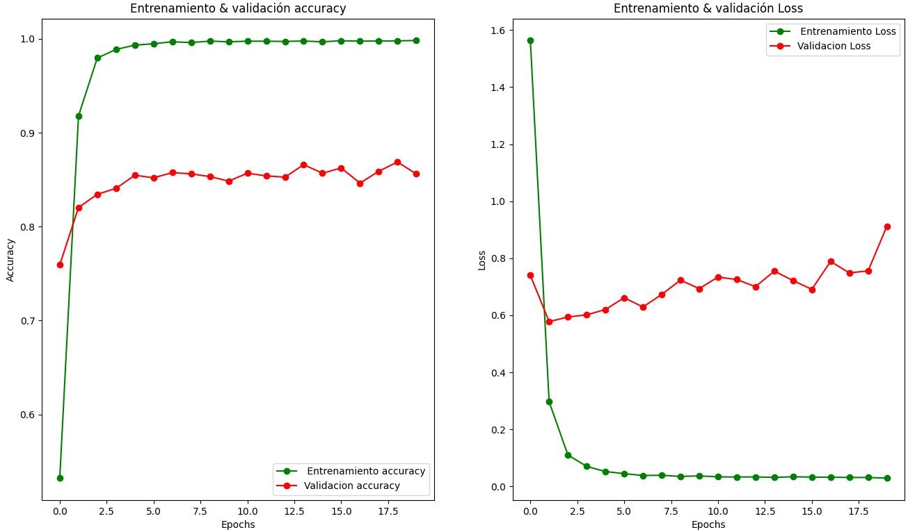

# ANN_AmericanSignLanguage
Artificial Neural Network Developed with TensorFlow for the Detection and Classification of Sign Language Using the MNIST (American Sign Language) Dataset

## Training Images

## Model Creation from Scratch

## Regularized Model

## Convolutional Network

## Recognition
In recognition of the significant achievement and outstanding contributions to the development and implementation of a neural network model for the detection and classification of American Sign Language using the MNIST dataset, the following certificate is awarded:

